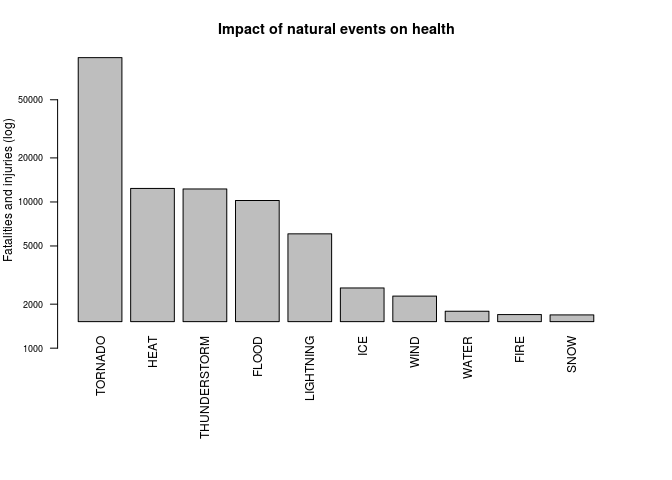
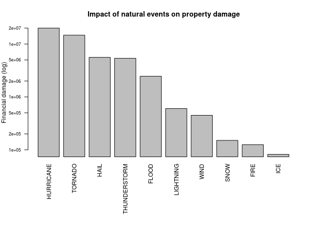
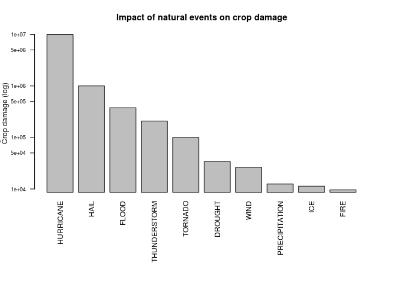

# Basic answers about severe weather events, using the NOAA Storm Database

## 1. Synopsis

*(This page is my work for the *Peer-graded Assignment (Course Project 2)* of the "Reproducible Research" course by Johns Hopkins University, tought on Coursera.)*

The basic goal of this assignment is to explore the NOAA Storm Database and answer some basic questions about severe weather events. We use the NOAA database to answer some questions below, showing the code for the entire analysis.

The questions are:
- Across the United States, which types of events are most harmful with respect to population health?
- Across the United States, which types of events have the greatest economic consequences?

## 2. Environment Setup

Here we import the needed lib(s), and set the chunk options globally for this page:

```r
library(knitr)
opts_chunk$set(echo=TRUE)
```

## 3. Data Processing
### 3.1 Loading and preprocessing the data

Let's unpack the compressed archive and load the enclosed CSV data. We will not bother parsing dates.

```r
file_name <- "repdata_data_StormData.csv.bz2"
url <- "https://d396qusza40orc.cloudfront.net/repdata%2Fdata%2FStormData.csv.bz2"

if (!file.exists(file_name)) {
    download.file(url, file_name)
}

stormdata <- read.csv(file_name) # decompress and load
```

### 3.2 Examining the event types
As we can see in Annex A, the EVTYPE variable is not normalized, and there are also typos.

### 3.3 Grouping event types
In order to have more synthetic event categories (less groups and no typo effects) let's create the `evgroup` variable:

```r
evgroup <- tolower(as.character(stormdata$EVTYPE)) # copy original events as lowercase

evgroup[grepl("\\<(blizzard)\\>", evgroup)] <- "BLIZZARD"
evgroup[grepl("\\<(cold|cool|low temp(erature)?|hypothermia|windchill)\\>", evgroup)] <- "COLD"
evgroup[grepl("\\<(dry(ness)?|driest|drought)\\>", evgroup)] <- "DROUGHT"
evgroup[grepl("\\<(erosio?n|landslump)\\>", evgroup)] <- "EROSION"
evgroup[grepl("\\<(wild)?fires?\\>", evgroup)] <- "FIRE"
evgroup[grepl("\\<(flo+d(|s|ing)|fldg|stream|drowning|(coastal)?flood(|in))\\>", evgroup)] <- "FLOOD"
evgroup[grepl("\\<(fog|dust(storm)?|smoke|)\\>", evgroup)] <- "FOG_AND_DUST"
evgroup[grepl("\\<hail(storms?)?\\>", evgroup)] <- "HAIL"
evgroup[grepl("\\<(warm|warmth|hot|high temperatures?|heat(burst)?|hyperthermia)\\>", evgroup)] <- "HEAT"
evgroup[grepl("(hurricane|typhoon|tropical depression)", evgroup)] <- "HURRICANE"
evgroup[grepl("\\<ic[ye]|freeze|freezing|frost|glaze|sleet\\>", evgroup)] <- "ICE"
evgroup[grepl("\\<lig[hn]tn?ing\\>", evgroup)] <- "LIGHTNING"
evgroup[grepl("\\<(precip([ia]tation)?|rainfall|rains?|showers?|rainstorms?)\\>", evgroup)] <- "PRECIPITATION"
evgroup[grepl("slide", evgroup)] <- "SLIDE"
evgroup[grepl("\\<((thunder)?snow(storm)?|snow(s|fall|pack)?|avalanch?e)\\>", evgroup)] <- "SNOW"
evgroup[grepl("\\<((coastal)?storm|thun?d?e+r?s?torm[sw]?|thunderestorm|thunderstrom|tstmw?)", evgroup)] <- "THUNDERSTORM"
evgroup[grepl("\\<((tornado|TORNDAO)e?s?|funnels?|gustnado|microburst|landspout|wall cloud|downburst|way?ter(spout.*)?)\\>", evgroup)] <- "TORNADO"
evgroup[grepl("\\<(volcanic|vog)\\>", evgroup)] <- "VOLCANISM"
evgroup[grepl("\\<(tsunami|surf|currents?|rogue wave|seas?|marine|tides?|high waves|swells|coastal surge)\\>", evgroup)] <- "WATER"
evgroup[grepl("\\<wet(ness)?\\>", evgroup)] <- "WETNESS"
evgroup[grepl("\\<(wind|wnd|(whirl)?winds?)\\>", evgroup)] <- "WIND"
evgroup[grepl("\\<(winter|winte?ry)\\>", evgroup)] <- "WINTER"

evgroup[grepl("[a-z]", evgroup)] <- "OTHER" # collect any uncategorized original events (lowercase)

evgroup <-as.factor(evgroup)
```
This was quite some work, and we'll see later if it pays.

All events that were not categorized are collected all together in the `OTHER` group. We will see if doing so has only marginal effect on the results.

### 3.4 Exploring the data
Let's evaluate the impact on health (fatalities and injuries):

```r
health.impact <- stormdata$FATALITIES + stormdata$INJURIES;
df = data.frame(evgroup=evgroup, value=health.impact)
impact <- aggregate(value ~ evgroup, data = df, sum)
impact.ordered.top <- impact[order(impact$value, decreasing = TRUE),][1:10,]
```

Impact per natural event group:

```r
impact.ordered.top
```

```
##         evgroup value
## 19      TORNADO 97082
## 10         HEAT 12372
## 18 THUNDERSTORM 12265
## 7         FLOOD 10232
## 13    LIGHTNING  6049
## 12          ICE  2581
## 23         WIND  2271
## 21        WATER  1788
## 6          FIRE  1698
## 17         SNOW  1688
```
As we can see, there is a domination of the first event over the others, by almost one order of magnitude. So to better distinguish the values, we will plot the values with a logarithmic scale. 

### 3.5 Plotting helper
At this point, as we plan to produce a few aggregated graphs and lists of identical nature, let's create a function to generate them easily later:

```r
makeplot <- function(events, values, what, ylab) {
    top.n <- 10;
    df = data.frame(evgroup=events, value=values)
    impact <- aggregate(value ~ evgroup, data = df, sum)
    impact.ordered.top <- impact[order(impact$value, decreasing = TRUE),][1:top.n,]
    par(mar = c(11,4,4,4), cex = 0.75)
    barplot(impact.ordered.top$value,
        main = paste("Impact of natural events on", what),
        ylab = paste(ylab, "(log)"),
#        xlab = paste(ylab, "caused by natural events"),
        names.arg = impact.ordered.top$evgroup,
        cex.axis = 0.75,
        log = "y",  # log scale!
        las = 2)
}

make_list <- function(events, values) {
    top.n <- 10;
    df = data.frame(evgroup=events, value=values)
    impact <- aggregate(value ~ evgroup, data = df, sum)
    impact.ordered.top <- impact[order(impact$value, decreasing = TRUE),][1:top.n,]
    print(impact.ordered.top)
}
```

To quantify the damages, two variables (per damage) are used: the value, and an exponent in numeric or alphabetic form.
Let's create a function to compute the numeric damage value:

```r
decode_value <- function(v, e) {
    res <- v
    res[e=="b"] <-res[e=="b"] * 1e9
    res[e=="m"] <-res[e=="m"] * 1e6
    res[e=="k"] <-res[e=="k"] * 1e3
    res[e=="2"] <-res[e=="2"] * 1e2
    res
}
```

## 4. Results
### 4.1 Impact of natural events on population health

```r
health.impact <- stormdata$FATALITIES + stormdata$INJURIES;
makeplot(evgroup, health.impact, "health", "Fatalities and injuries")
```

<!-- -->

We see a clear dominant impact of hurricanes.

### 4.2 Impact on property damage

```r
property.damages <- decode_value(stormdata$PROPDMG, stormdata$PROPDMGEXP)
makeplot(evgroup, property.damages, "property damage", "Financial damage")
```

<!-- -->

HURRICANE and TORNADO dominate.

Comment: We can see that hurricanes have less impact than tornados **on population health**, probably due to the fact that hurricanes are better predicted, allowing population evacuation.

### 4.3 Impact on crop damage

```r
crop.damages <- decode_value(stormdata$CROPDMG, stormdata$CROPDMGEXP)
makeplot(evgroup, crop.damages, "crop damage", "Ĉrop damage")
```

<!-- -->

## 5. Further Research
To strictly restrict the research to the United States, geographic data enclosed in the data set could be used to filter the observations.


HURRICANE clearly dominate.

Comment: crops looks more resistant to natural events (other than HURRICANE) than property items.

# Annex A - Event types
The EVTYPE variable of the dataset is:

```r
levels(stormdata$EVTYPE)
```

```
##   [1] "?"                              "ABNORMAL WARMTH"               
##   [3] "AGRICULTURAL FREEZE"            "APACHE COUNTY"                 
##   [5] "AVALANCE"                       "AVALANCHE"                     
##   [7] "BEACH EROSIN"                   "Beach Erosion"                 
##   [9] "BEACH EROSION"                  "BEACH EROSION/COASTAL FLOOD"   
##  [11] "BEACH FLOOD"                    "BELOW NORMAL PRECIPITATION"    
##  [13] "BITTER WIND CHILL"              "BITTER WIND CHILL TEMPERATURES"
##  [15] "Black Ice"                      "BLACK ICE"                     
##  [17] "BLIZZARD"                       "BLIZZARD AND EXTREME WIND CHIL"
##  [19] "BLIZZARD AND HEAVY SNOW"        "BLIZZARD/FREEZING RAIN"        
##  [21] "BLIZZARD/HEAVY SNOW"            "BLIZZARD/HIGH WIND"            
##  [23] "Blizzard Summary"               "BLIZZARD WEATHER"              
##  [25] "BLIZZARD/WINTER STORM"          "BLOWING DUST"                  
##  [27] "blowing snow"                   "Blowing Snow"                  
##  [29] "BLOWING SNOW"                   "BLOWING SNOW & EXTREME WIND CH"
##  [31] "BLOWING SNOW- EXTREME WIND CHI" "BLOWING SNOW/EXTREME WIND CHIL"
##  [33] "BLOW-OUT TIDE"                  "BLOW-OUT TIDES"                
##  [35] "BREAKUP FLOODING"               "BRUSH FIRE"                    
##  [37] "BRUSH FIRES"                    "COASTAL EROSION"               
##  [39] "Coastal Flood"                  "COASTALFLOOD"                  
##  [41] " COASTAL FLOOD"                 "COASTAL FLOOD"                 
##  [43] "coastal flooding"               "Coastal Flooding"              
##  [45] "COASTAL FLOODING"               "COASTAL FLOODING/EROSION"      
##  [47] "Coastal Storm"                  "COASTALSTORM"                  
##  [49] "COASTAL STORM"                  "COASTAL SURGE"                 
##  [51] "COASTAL/TIDAL FLOOD"            "Cold"                          
##  [53] "COLD"                           "COLD AIR FUNNEL"               
##  [55] "COLD AIR FUNNELS"               "COLD AIR TORNADO"              
##  [57] "Cold and Frost"                 "COLD AND FROST"                
##  [59] "COLD AND SNOW"                  "COLD AND WET CONDITIONS"       
##  [61] "Cold Temperature"               "COLD TEMPERATURES"             
##  [63] "COLD WAVE"                      "COLD WEATHER"                  
##  [65] "COLD WIND CHILL TEMPERATURES"   "COLD/WINDS"                    
##  [67] "COOL AND WET"                   "Damaging Freeze"               
##  [69] "DAMAGING FREEZE"                "DAM BREAK"                     
##  [71] "DAM FAILURE"                    "DEEP HAIL"                     
##  [73] "DENSE FOG"                      "DOWNBURST"                     
##  [75] "DOWNBURST WINDS"                "Drifting Snow"                 
##  [77] "DROUGHT"                        "DROUGHT/EXCESSIVE HEAT"        
##  [79] "DRY"                            "DRY HOT WEATHER"               
##  [81] "DRY MICROBURST"                 "DRY MICROBURST 50"             
##  [83] "DRY MICROBURST 53"              "DRY MICROBURST 58"             
##  [85] "DRY MICROBURST 61"              "DRY MICROBURST 84"             
##  [87] "DRY MICROBURST WINDS"           "DRY MIRCOBURST WINDS"          
##  [89] "DRY PATTERN"                    "DRY SPELL"                     
##  [91] "DRY WEATHER"                    "Dust Devil"                    
##  [93] "DUST DEVIL"                     "DUST DEVIL WATERSPOUT"         
##  [95] "DUSTSTORM"                      "DUST STORM"                    
##  [97] "DUST STORM/HIGH WINDS"          "EARLY FREEZE"                  
##  [99] "Early Frost"                    "EARLY FROST"                   
## [101] "EARLY RAIN"                     "EARLY SNOW"                    
## [103] "Early snowfall"                 "Erosion/Cstl Flood"            
## [105] "EXCESSIVE"                      "Excessive Cold"                
## [107] "EXCESSIVE HEAT"                 "EXCESSIVE PRECIPITATION"       
## [109] "EXCESSIVE RAIN"                 "EXCESSIVE RAINFALL"            
## [111] "EXCESSIVE WETNESS"              "Extended Cold"                 
## [113] "Extreme Cold"                   "EXTREME COLD"                  
## [115] "EXTREME HEAT"                   "EXTREME/RECORD COLD"           
## [117] "EXTREME WINDCHILL"              "EXTREME WIND CHILL"            
## [119] "EXTREME WIND CHILL/BLOWING SNO" "EXTREME WIND CHILLS"           
## [121] "FIRST SNOW"                     "FLASH FLOOD"                   
## [123] "FLASH FLOOD/"                   "FLASH FLOOD/FLOOD"             
## [125] "FLASH FLOOD/ FLOOD"             "FLASH FLOOD FROM ICE JAMS"     
## [127] "FLASH FLOOD - HEAVY RAIN"       "FLASH FLOOD/HEAVY RAIN"        
## [129] "FLASH FLOODING"                 "FLASH FLOODING/FLOOD"          
## [131] "FLASH FLOODING/THUNDERSTORM WI" "FLASH FLOOD/LANDSLIDE"         
## [133] "FLASH FLOOD LANDSLIDES"         "FLASH FLOODS"                  
## [135] "FLASH FLOOD/ STREET"            "FLASH FLOOD WINDS"             
## [137] "FLASH FLOOODING"                "Flood"                         
## [139] "FLOOD"                          "FLOOD FLASH"                   
## [141] "FLOOD/FLASH"                    "Flood/Flash Flood"             
## [143] "FLOOD/FLASHFLOOD"               "FLOOD/FLASH FLOOD"             
## [145] "FLOOD/FLASH FLOODING"           "FLOOD FLOOD/FLASH"             
## [147] "FLOOD & HEAVY RAIN"             "FLOODING"                      
## [149] "FLOODING/HEAVY RAIN"            "FLOOD/RAIN/WIND"               
## [151] "FLOOD/RAIN/WINDS"               "FLOOD/RIVER FLOOD"             
## [153] "FLOODS"                         "Flood/Strong Wind"             
## [155] "FLOOD WATCH/"                   "FOG"                           
## [157] "FOG AND COLD TEMPERATURES"      "FOREST FIRES"                  
## [159] "Freeze"                         "FREEZE"                        
## [161] "Freezing drizzle"               "Freezing Drizzle"              
## [163] "FREEZING DRIZZLE"               "FREEZING DRIZZLE AND FREEZING" 
## [165] "Freezing Fog"                   "Freezing rain"                 
## [167] "Freezing Rain"                  "FREEZING RAIN"                 
## [169] "FREEZING RAIN AND SLEET"        "FREEZING RAIN AND SNOW"        
## [171] "FREEZING RAIN/SLEET"            "FREEZING RAIN SLEET AND"       
## [173] "FREEZING RAIN SLEET AND LIGHT"  "FREEZING RAIN/SNOW"            
## [175] "Freezing Spray"                 "Frost"                         
## [177] "FROST"                          "Frost/Freeze"                  
## [179] "FROST\\FREEZE"                  "FUNNEL"                        
## [181] "Funnel Cloud"                   "FUNNEL CLOUD"                  
## [183] "FUNNEL CLOUD."                  "FUNNEL CLOUD/HAIL"             
## [185] "FUNNEL CLOUDS"                  "FUNNELS"                       
## [187] "Glaze"                          "GLAZE"                         
## [189] "GLAZE ICE"                      "GLAZE/ICE STORM"               
## [191] "gradient wind"                  "Gradient wind"                 
## [193] "GRADIENT WIND"                  "GRADIENT WINDS"                
## [195] "GRASS FIRES"                    "GROUND BLIZZARD"               
## [197] "GUSTNADO"                       "GUSTNADO AND"                  
## [199] "Gusty Wind"                     "GUSTY WIND"                    
## [201] "GUSTY WIND/HVY RAIN"            "Gusty wind/rain"               
## [203] "Gusty winds"                    "Gusty Winds"                   
## [205] "GUSTY WINDS"                    "HAIL"                          
## [207] "Hail(0.75)"                     "HAIL 075"                      
## [209] "HAIL 0.75"                      "HAIL 088"                      
## [211] "HAIL 0.88"                      "HAIL 100"                      
## [213] "HAIL 1.00"                      "HAIL 125"                      
## [215] "HAIL 150"                       "HAIL 175"                      
## [217] "HAIL 1.75"                      "HAIL 1.75)"                    
## [219] "HAIL 200"                       "HAIL 225"                      
## [221] "HAIL 275"                       "HAIL 450"                      
## [223] "HAIL 75"                        "HAIL 80"                       
## [225] "HAIL 88"                        "HAIL ALOFT"                    
## [227] "HAIL DAMAGE"                    "HAIL FLOODING"                 
## [229] "HAIL/ICY ROADS"                 "HAILSTORM"                     
## [231] "HAIL STORM"                     "HAILSTORMS"                    
## [233] "HAIL/WIND"                      "HAIL/WINDS"                    
## [235] "HARD FREEZE"                    "HEAT"                          
## [237] "Heatburst"                      "HEAT DROUGHT"                  
## [239] "HEAT/DROUGHT"                   "Heat Wave"                     
## [241] "HEAT WAVE"                      "HEAT WAVE DROUGHT"             
## [243] "HEAT WAVES"                     "HEAVY LAKE SNOW"               
## [245] "HEAVY MIX"                      "HEAVY PRECIPATATION"           
## [247] "Heavy Precipitation"            "HEAVY PRECIPITATION"           
## [249] "Heavy rain"                     "Heavy Rain"                    
## [251] "HEAVY RAIN"                     "HEAVY RAIN AND FLOOD"          
## [253] "Heavy Rain and Wind"            "HEAVY RAINFALL"                
## [255] "HEAVY RAIN/FLOODING"            "Heavy Rain/High Surf"          
## [257] "HEAVY RAIN/LIGHTNING"           "HEAVY RAIN/MUDSLIDES/FLOOD"    
## [259] "HEAVY RAINS"                    "HEAVY RAIN/SEVERE WEATHER"     
## [261] "HEAVY RAINS/FLOODING"           "HEAVY RAIN/SMALL STREAM URBAN" 
## [263] "HEAVY RAIN/SNOW"                "HEAVY RAIN/URBAN FLOOD"        
## [265] "HEAVY RAIN; URBAN FLOOD WINDS;" "HEAVY RAIN/WIND"               
## [267] "HEAVY SEAS"                     "HEAVY SHOWER"                  
## [269] "HEAVY SHOWERS"                  "HEAVY SNOW"                    
## [271] "HEAVY SNOW AND"                 "HEAVY SNOW ANDBLOWING SNOW"    
## [273] "HEAVY SNOW AND HIGH WINDS"      "HEAVY SNOW AND ICE"            
## [275] "HEAVY SNOW AND ICE STORM"       "HEAVY SNOW AND STRONG WINDS"   
## [277] "HEAVY SNOW/BLIZZARD"            "HEAVY SNOW/BLIZZARD/AVALANCHE" 
## [279] "HEAVY SNOW/BLOWING SNOW"        "HEAVY SNOW   FREEZING RAIN"    
## [281] "HEAVY SNOW/FREEZING RAIN"       "HEAVY SNOW/HIGH"               
## [283] "HEAVY SNOW/HIGH WIND"           "HEAVY SNOW/HIGH WINDS"         
## [285] "HEAVY SNOW/HIGH WINDS & FLOOD"  "HEAVY SNOW/HIGH WINDS/FREEZING"
## [287] "HEAVY SNOW & ICE"               "HEAVY SNOW/ICE"                
## [289] "HEAVY SNOW/ICE STORM"           "HEAVY SNOWPACK"                
## [291] "Heavy snow shower"              "HEAVY SNOW/SLEET"              
## [293] "HEAVY SNOW SQUALLS"             "HEAVY SNOW-SQUALLS"            
## [295] "HEAVY SNOW/SQUALLS"             "HEAVY SNOW/WIND"               
## [297] "HEAVY SNOW/WINTER STORM"        "Heavy Surf"                    
## [299] "HEAVY SURF"                     "Heavy surf and wind"           
## [301] "HEAVY SURF COASTAL FLOODING"    "HEAVY SWELLS"                  
## [303] "HEAVY WET SNOW"                 "HIGH"                          
## [305] "HIGH SEAS"                      "High Surf"                     
## [307] "HIGH SURF"                      "HIGH SWELLS"                   
## [309] "HIGH  SWELLS"                   "HIGH TEMPERATURE RECORD"       
## [311] "HIGH TIDES"                     "HIGH WATER"                    
## [313] "HIGH WAVES"                     "HIGHWAY FLOODING"              
## [315] "High Wind"                      "HIGH WIND"                     
## [317] "HIGH WIND 48"                   "HIGH WIND 63"                  
## [319] "HIGH WIND 70"                   "HIGH WIND AND HEAVY SNOW"      
## [321] "HIGH WIND AND HIGH TIDES"       "HIGH WIND AND SEAS"            
## [323] "HIGH WIND/BLIZZARD"             "HIGH WIND/ BLIZZARD"           
## [325] "HIGH WIND/BLIZZARD/FREEZING RA" "HIGH WIND DAMAGE"              
## [327] "HIGH WIND (G40)"                "HIGH WIND/HEAVY SNOW"          
## [329] "HIGH WIND/LOW WIND CHILL"       "HIGH WINDS"                    
## [331] "HIGH  WINDS"                    "HIGH WINDS/"                   
## [333] "HIGH WINDS 55"                  "HIGH WINDS 57"                 
## [335] "HIGH WINDS 58"                  "HIGH WINDS 63"                 
## [337] "HIGH WINDS 66"                  "HIGH WINDS 67"                 
## [339] "HIGH WINDS 73"                  "HIGH WINDS 76"                 
## [341] "HIGH WINDS 80"                  "HIGH WINDS 82"                 
## [343] "HIGH WINDS AND WIND CHILL"      "HIGH WINDS/COASTAL FLOOD"      
## [345] "HIGH WINDS/COLD"                "HIGH WINDS DUST STORM"         
## [347] "HIGH WIND/SEAS"                 "HIGH WINDS/FLOODING"           
## [349] "HIGH WINDS/HEAVY RAIN"          "HIGH WINDS HEAVY RAINS"        
## [351] "HIGH WINDS/SNOW"                "HIGH WIND/WIND CHILL"          
## [353] "HIGH WIND/WIND CHILL/BLIZZARD"  "Hot and Dry"                   
## [355] "HOT/DRY PATTERN"                "HOT PATTERN"                   
## [357] "HOT SPELL"                      "HURRICANE"                     
## [359] "Hurricane Edouard"              "HURRICANE EMILY"               
## [361] "HURRICANE ERIN"                 "HURRICANE FELIX"               
## [363] "HURRICANE-GENERATED SWELLS"     "HURRICANE GORDON"              
## [365] "HURRICANE OPAL"                 "HURRICANE OPAL/HIGH WINDS"     
## [367] "HVY RAIN"                       "HYPOTHERMIA"                   
## [369] "Hypothermia/Exposure"           "HYPOTHERMIA/EXPOSURE"          
## [371] "ICE"                            "ICE AND SNOW"                  
## [373] "ICE FLOES"                      "Ice Fog"                       
## [375] "ICE JAM"                        "ICE JAM FLOODING"              
## [377] "Ice jam flood (minor"           "Ice/Snow"                      
## [379] "ICE/SNOW"                       "ICE STORM"                     
## [381] "ICE STORM AND SNOW"             "Icestorm/Blizzard"             
## [383] "ICE STORM/FLASH FLOOD"          "ICE/STRONG WINDS"              
## [385] "Icy Roads"                      "ICY ROADS"                     
## [387] "LACK OF SNOW"                   "Lake Effect Snow"              
## [389] "LAKE EFFECT SNOW"               "LAKE-EFFECT SNOW"              
## [391] "LAKE FLOOD"                     "LANDSLIDE"                     
## [393] "LANDSLIDES"                     "LANDSLIDE/URBAN FLOOD"         
## [395] "Landslump"                      "LARGE WALL CLOUD"              
## [397] "LATE FREEZE"                    "Late-season Snowfall"          
## [399] "Late Season Snowfall"           "LATE SNOW"                     
## [401] "LIGHTING"                       "LIGHTNING"                     
## [403] " LIGHTNING"                     "LIGHTNING."                    
## [405] "LIGHTNING AND HEAVY RAIN"       "LIGHTNING AND THUNDERSTORM WIN"
## [407] "LIGHTNING AND WINDS"            "LIGHTNING DAMAGE"              
## [409] "LIGHTNING FIRE"                 "LIGHTNING/HEAVY RAIN"          
## [411] "LIGHTNING INJURY"               "LIGHTNING THUNDERSTORM WINDS"  
## [413] "LIGHTNING THUNDERSTORM WINDSS"  "LIGHTNING  WAUSEON"            
## [415] "Light snow"                     "Light Snow"                    
## [417] "LIGHT SNOW"                     "LIGHT SNOW AND SLEET"          
## [419] "Light Snowfall"                 "Light Snow/Flurries"           
## [421] "LIGNTNING"                      "LOCAL FLASH FLOOD"             
## [423] "LOCAL FLOOD"                    "LOW TEMPERATURE"               
## [425] "LOW TEMPERATURE RECORD"         "LOW WIND CHILL"                
## [427] "MAJOR FLOOD"                    "Marine Accident"               
## [429] "MARINE MISHAP"                  "Metro Storm, May 26"           
## [431] "Microburst"                     "MICROBURST"                    
## [433] "MICROBURST WINDS"               "Mild and Dry Pattern"          
## [435] "MILD/DRY PATTERN"               "MILD PATTERN"                  
## [437] "MINOR FLOOD"                    "Minor Flooding"                
## [439] "MINOR FLOODING"                 "MIXED PRECIP"                  
## [441] "Mixed Precipitation"            "MODERATE SNOW"                 
## [443] "MODERATE SNOWFALL"              "Monthly Rainfall"              
## [445] "MONTHLY RAINFALL"               "Monthly Snowfall"              
## [447] "Mountain Snows"                 "MUD/ROCK SLIDE"                
## [449] "Mudslide"                       "MUDSLIDE"                      
## [451] "MUD SLIDE"                      "MUDSLIDE/LANDSLIDE"            
## [453] "Mudslides"                      "MUDSLIDES"                     
## [455] "MUD SLIDES"                     "MUD SLIDES URBAN FLOODING"     
## [457] "NEAR RECORD SNOW"               "NONE"                          
## [459] "NORMAL PRECIPITATION"           "No Severe Weather"             
## [461] "Other"                          "OTHER"                         
## [463] "Prolong Cold"                   "PROLONG COLD"                  
## [465] "PROLONG COLD/SNOW"              "PROLONGED RAIN"                
## [467] "RAIN"                           "RAIN AND WIND"                 
## [469] "Rain Damage"                    "RAIN (HEAVY)"                  
## [471] "RAIN/SNOW"                      "RAINSTORM"                     
## [473] "RAIN/WIND"                      "RAPIDLY RISING WATER"          
## [475] "Record Cold"                    "RECORD COLD"                   
## [477] "RECORD COLD AND HIGH WIND"      "RECORD COLD/FROST"             
## [479] "Record dry month"               "RECORD/EXCESSIVE HEAT"         
## [481] "RECORD/EXCESSIVE RAINFALL"      "Record Heat"                   
## [483] "RECORD HEAT"                    "RECORD HEAT WAVE"              
## [485] "Record High"                    "RECORD HIGH"                   
## [487] "RECORD HIGH TEMPERATURE"        "RECORD HIGH TEMPERATURES"      
## [489] "RECORD LOW"                     "Record May Snow"               
## [491] "RECORD RAINFALL"                "RECORD SNOW"                   
## [493] "RECORD SNOW/COLD"               "RECORD SNOWFALL"               
## [495] "Record temperature"             "Record Temperatures"           
## [497] "RECORD TEMPERATURES"            "RECORD WARM TEMPS."            
## [499] "Record Warmth"                  "RECORD WARMTH"                 
## [501] "Record Winter Snow"             "RIP CURRENT"                   
## [503] "RIP CURRENTS"                   "RIP CURRENTS HEAVY SURF"       
## [505] "RIP CURRENTS/HEAVY SURF"        "RIVER AND STREAM FLOOD"        
## [507] "RIVER FLOOD"                    "River Flooding"                
## [509] "RIVER FLOODING"                 "ROTATING WALL CLOUD"           
## [511] "ROUGH SURF"                     "RURAL FLOOD"                   
## [513] "Saharan Dust"                   "SAHARAN DUST"                  
## [515] "Seasonal Snowfall"              "SEICHE"                        
## [517] "SEVERE COLD"                    "SEVERE THUNDERSTORM"           
## [519] "SEVERE THUNDERSTORMS"           "SEVERE THUNDERSTORM WINDS"     
## [521] "SEVERE TURBULENCE"              "SLEET"                         
## [523] "SLEET & FREEZING RAIN"          "SLEET/FREEZING RAIN"           
## [525] "SLEET/ICE STORM"                "SLEET/RAIN/SNOW"               
## [527] "SLEET/SNOW"                     "small hail"                    
## [529] "Small Hail"                     "SMALL HAIL"                    
## [531] "SMALL STREAM"                   "SMALL STREAM AND"              
## [533] "SMALL STREAM AND URBAN FLOOD"   "SMALL STREAM AND URBAN FLOODIN"
## [535] "SMALL STREAM FLOOD"             "SMALL STREAM FLOODING"         
## [537] "SMALL STREAM URBAN FLOOD"       "SMALL STREAM/URBAN FLOOD"      
## [539] "Sml Stream Fld"                 "Snow"                          
## [541] "SNOW"                           "Snow Accumulation"             
## [543] "SNOW ACCUMULATION"              "SNOW AND COLD"                 
## [545] "SNOW AND HEAVY SNOW"            "Snow and Ice"                  
## [547] "SNOW AND ICE"                   "SNOW AND ICE STORM"            
## [549] "Snow and sleet"                 "SNOW AND WIND"                 
## [551] "SNOW/ BITTER COLD"              "SNOW/BLOWING SNOW"             
## [553] "SNOW/COLD"                      "SNOW\\COLD"                    
## [555] "SNOW DROUGHT"                   "SNOWFALL RECORD"               
## [557] "SNOW FREEZING RAIN"             "SNOW/FREEZING RAIN"            
## [559] "SNOW/HEAVY SNOW"                "SNOW/HIGH WINDS"               
## [561] "SNOW- HIGH WIND- WIND CHILL"    "SNOW/ICE"                      
## [563] "SNOW/ ICE"                      "SNOW/ICE STORM"                
## [565] "SNOWMELT FLOODING"              "SNOW/RAIN"                     
## [567] "SNOW/RAIN/SLEET"                "SNOW SHOWERS"                  
## [569] "SNOW SLEET"                     "SNOW/SLEET"                    
## [571] "SNOW/SLEET/FREEZING RAIN"       "SNOW/SLEET/RAIN"               
## [573] "SNOW SQUALL"                    "Snow squalls"                  
## [575] "Snow Squalls"                   "SNOW SQUALLS"                  
## [577] "SNOWSTORM"                      "SOUTHEAST"                     
## [579] "STORM FORCE WINDS"              "STORM SURGE"                   
## [581] "STREAM FLOODING"                "STREET FLOOD"                  
## [583] "STREET FLOODING"                "Strong Wind"                   
## [585] "STRONG WIND"                    "STRONG WIND GUST"              
## [587] "Strong winds"                   "Strong Winds"                  
## [589] "STRONG WINDS"                   "Summary August 10"             
## [591] "Summary August 11"              "Summary August 17"             
## [593] "Summary August 21"              "Summary August 2-3"            
## [595] "Summary August 28"              "Summary August 4"              
## [597] "Summary August 7"               "Summary August 9"              
## [599] "Summary Jan 17"                 "Summary July 23-24"            
## [601] "Summary June 18-19"             "Summary June 5-6"              
## [603] "Summary June 6"                 "Summary: Nov. 16"              
## [605] "Summary: Nov. 6-7"              "Summary: Oct. 20-21"           
## [607] "Summary: October 31"            "Summary of April 12"           
## [609] "Summary of April 13"            "Summary of April 21"           
## [611] "Summary of April 27"            "Summary of April 3rd"          
## [613] "Summary of August 1"            "Summary of July 11"            
## [615] "Summary of July 2"              "Summary of July 22"            
## [617] "Summary of July 26"             "Summary of July 29"            
## [619] "Summary of July 3"              "Summary of June 10"            
## [621] "Summary of June 11"             "Summary of June 12"            
## [623] "Summary of June 13"             "Summary of June 15"            
## [625] "Summary of June 16"             "Summary of June 18"            
## [627] "Summary of June 23"             "Summary of June 24"            
## [629] "Summary of June 3"              "Summary of June 30"            
## [631] "Summary of June 4"              "Summary of June 6"             
## [633] "Summary of March 14"            "Summary of March 23"           
## [635] "Summary of March 24"            "SUMMARY OF MARCH 24-25"        
## [637] "SUMMARY OF MARCH 27"            "SUMMARY OF MARCH 29"           
## [639] "Summary of May 10"              "Summary of May 13"             
## [641] "Summary of May 14"              "Summary of May 22"             
## [643] "Summary of May 22 am"           "Summary of May 22 pm"          
## [645] "Summary of May 26 am"           "Summary of May 26 pm"          
## [647] "Summary of May 31 am"           "Summary of May 31 pm"          
## [649] "Summary of May 9-10"            "Summary: Sept. 18"             
## [651] "Summary Sept. 25-26"            "Summary September 20"          
## [653] "Summary September 23"           "Summary September 3"           
## [655] "Summary September 4"            "Temperature record"            
## [657] "THUDERSTORM WINDS"              "THUNDEERSTORM WINDS"           
## [659] "THUNDERESTORM WINDS"            "THUNDERSNOW"                   
## [661] "Thundersnow shower"             "THUNDERSTORM"                  
## [663] "THUNDERSTORM DAMAGE"            "THUNDERSTORM DAMAGE TO"        
## [665] "THUNDERSTORM HAIL"              "THUNDERSTORMS"                 
## [667] "THUNDERSTORMS WIND"             "THUNDERSTORMS WINDS"           
## [669] "THUNDERSTORMW"                  "THUNDERSTORMW 50"              
## [671] "Thunderstorm Wind"              "THUNDERSTORM WIND"             
## [673] "THUNDERSTORM WIND."             "THUNDERSTORM WIND 50"          
## [675] "THUNDERSTORM WIND 52"           "THUNDERSTORM WIND 56"          
## [677] "THUNDERSTORM WIND 59"           "THUNDERSTORM WIND 59 MPH"      
## [679] "THUNDERSTORM WIND 59 MPH."      "THUNDERSTORM WIND 60 MPH"      
## [681] "THUNDERSTORM WIND 65MPH"        "THUNDERSTORM WIND 65 MPH"      
## [683] "THUNDERSTORM WIND 69"           "THUNDERSTORM WIND 98 MPH"      
## [685] "THUNDERSTORM WIND/AWNING"       "THUNDERSTORM WIND G50"         
## [687] "THUNDERSTORM WIND G51"          "THUNDERSTORM WIND G52"         
## [689] "THUNDERSTORM WIND G55"          "THUNDERSTORM WIND G60"         
## [691] "THUNDERSTORM WIND G61"          "THUNDERSTORM WIND/HAIL"        
## [693] "THUNDERSTORM WIND/LIGHTNING"    "THUNDERSTORMWINDS"             
## [695] "THUNDERSTORM WINDS"             "THUNDERSTORM  WINDS"           
## [697] "THUNDERSTORM W INDS"            "THUNDERSTORM WINDS."           
## [699] "THUNDERSTORM WINDS 13"          "THUNDERSTORM WINDS 2"          
## [701] "THUNDERSTORM WINDS 50"          "THUNDERSTORM WINDS 52"         
## [703] "THUNDERSTORM WINDS53"           "THUNDERSTORM WINDS 53"         
## [705] "THUNDERSTORM WINDS 60"          "THUNDERSTORM WINDS 61"         
## [707] "THUNDERSTORM WINDS 62"          "THUNDERSTORM WINDS 63 MPH"     
## [709] "THUNDERSTORM WINDS AND"         "THUNDERSTORM WINDS/FLASH FLOOD"
## [711] "THUNDERSTORM WINDS/ FLOOD"      "THUNDERSTORM WINDS/FLOODING"   
## [713] "THUNDERSTORM WINDS FUNNEL CLOU" "THUNDERSTORM WINDS/FUNNEL CLOU"
## [715] "THUNDERSTORM WINDS G"           "THUNDERSTORM WINDS G60"        
## [717] "THUNDERSTORM WINDSHAIL"         "THUNDERSTORM WINDS HAIL"       
## [719] "THUNDERSTORM WINDS/HAIL"        "THUNDERSTORM WINDS/ HAIL"      
## [721] "THUNDERSTORM WINDS HEAVY RAIN"  "THUNDERSTORM WINDS/HEAVY RAIN" 
## [723] "THUNDERSTORM WINDS      LE CEN" "THUNDERSTORM WINDS LIGHTNING"  
## [725] "THUNDERSTORM WINDSS"            "THUNDERSTORM WINDS SMALL STREA"
## [727] "THUNDERSTORM WINDS URBAN FLOOD" "THUNDERSTORM WIND/ TREE"       
## [729] "THUNDERSTORM WIND TREES"        "THUNDERSTORM WIND/ TREES"      
## [731] "THUNDERSTORM WINS"              "THUNDERSTORMW WINDS"           
## [733] "THUNDERSTROM WIND"              "THUNDERSTROM WINDS"            
## [735] "THUNDERTORM WINDS"              "THUNDERTSORM WIND"             
## [737] "THUNDESTORM WINDS"              "THUNERSTORM WINDS"             
## [739] "TIDAL FLOOD"                    "Tidal Flooding"                
## [741] "TIDAL FLOODING"                 "TORNADO"                       
## [743] "TORNADOES"                      "TORNADOES, TSTM WIND, HAIL"    
## [745] "TORNADO F0"                     "TORNADO F1"                    
## [747] "TORNADO F2"                     "TORNADO F3"                    
## [749] "TORNADOS"                       "TORNADO/WATERSPOUT"            
## [751] "TORNDAO"                        "TORRENTIAL RAIN"               
## [753] "Torrential Rainfall"            "TROPICAL STORM"                
## [755] "TROPICAL STORM ALBERTO"         "TROPICAL STORM DEAN"           
## [757] "TROPICAL STORM GORDON"          "TROPICAL STORM JERRY"          
## [759] "TSTM HEAVY RAIN"                "TSTMW"                         
## [761] "Tstm Wind"                      " TSTM WIND"                    
## [763] "TSTM WIND"                      "TSTM WIND 40"                  
## [765] "TSTM WIND (41)"                 "TSTM WIND 45"                  
## [767] "TSTM WIND 50"                   "TSTM WIND 51"                  
## [769] "TSTM WIND 52"                   "TSTM WIND 55"                  
## [771] "TSTM WIND 65)"                  "TSTM WIND AND LIGHTNING"       
## [773] "TSTM WIND DAMAGE"               "TSTM WIND (G35)"               
## [775] "TSTM WIND (G40)"                " TSTM WIND (G45)"              
## [777] "TSTM WIND  (G45)"               "TSTM WIND (G45)"               
## [779] "TSTM WIND G58"                  "TSTM WIND/HAIL"                
## [781] "TSTM WINDS"                     "TSTM WND"                      
## [783] "TUNDERSTORM WIND"               "TYPHOON"                       
## [785] "Unseasonable Cold"              "UNSEASONABLY COLD"             
## [787] "UNSEASONABLY COOL"              "UNSEASONABLY DRY"              
## [789] "UNSEASONABLY HOT"               "UNSEASONABLY WARM"             
## [791] "UNSEASONABLY WARM AND DRY"      "UNSEASONABLY WET"              
## [793] "UNSEASONAL RAIN"                "UNUSUAL/RECORD WARMTH"         
## [795] "UNUSUAL WARMTH"                 "URBAN AND SMALL"               
## [797] "URBAN AND SMALL STREAM"         "URBAN AND SMALL STREAM FLOOD"  
## [799] "URBAN AND SMALL STREAM FLOODIN" "Urban flood"                   
## [801] "Urban Flood"                    "URBAN FLOOD"                   
## [803] "Urban Flooding"                 "URBAN FLOODING"                
## [805] "URBAN FLOOD LANDSLIDE"          "URBAN FLOODS"                  
## [807] "URBAN SMALL"                    "URBAN/SMALL"                   
## [809] "URBAN/SMALL FLOODING"           "URBAN/SMALL STREAM"            
## [811] "URBAN SMALL STREAM FLOOD"       "URBAN/SMALL STREAM FLOOD"      
## [813] "URBAN/SMALL STREAM  FLOOD"      "URBAN/SMALL STREAM FLOODING"   
## [815] "URBAN/SMALL STRM FLDG"          "URBAN/SML STREAM FLD"          
## [817] "URBAN/SML STREAM FLDG"          "URBAN/STREET FLOODING"         
## [819] "Volcanic Ash"                   "VOLCANIC ASH"                  
## [821] "Volcanic Ash Plume"             "WAKE LOW WIND"                 
## [823] "WALL CLOUD"                     "WALL CLOUD/FUNNEL CLOUD"       
## [825] "WARM DRY CONDITIONS"            "WATERSPOUT"                    
## [827] "WATER SPOUT"                    "WATERSPOUT-"                   
## [829] "WATERSPOUT/"                    "WATERSPOUT FUNNEL CLOUD"       
## [831] "WATERSPOUTS"                    "WATERSPOUT TORNADO"            
## [833] "WATERSPOUT-TORNADO"             "WATERSPOUT/TORNADO"            
## [835] "WATERSPOUT/ TORNADO"            "WAYTERSPOUT"                   
## [837] "wet micoburst"                  "WET MICROBURST"                
## [839] "Wet Month"                      "WET SNOW"                      
## [841] "WET WEATHER"                    "Wet Year"                      
## [843] "Whirlwind"                      "WILDFIRE"                      
## [845] "WILDFIRES"                      "WILD FIRES"                    
## [847] "WILD/FOREST FIRE"               "WILD/FOREST FIRES"             
## [849] "Wind"                           "WIND"                          
## [851] "WIND CHILL"                     "WIND CHILL/HIGH WIND"          
## [853] "Wind Damage"                    "WIND DAMAGE"                   
## [855] "WIND/HAIL"                      "WINDS"                         
## [857] "WIND STORM"                     "WINTER MIX"                    
## [859] "WINTER STORM"                   "WINTER STORM/HIGH WIND"        
## [861] "WINTER STORM HIGH WINDS"        "WINTER STORM/HIGH WINDS"       
## [863] "WINTER STORMS"                  "Winter Weather"                
## [865] "WINTER WEATHER"                 "WINTERY MIX"                   
## [867] "Wintry mix"                     "Wintry Mix"                    
## [869] "WINTRY MIX"
```
# Annex B - Effects of cleaning and grouping events
Does the grouping and cleanup of events that we did earlier have any noticeable effect?


```r
health.impact <- stormdata$FATALITIES + stormdata$INJURIES;
make_list(evgroup, health.impact)
```

```
##         evgroup value
## 19      TORNADO 97082
## 10         HEAT 12372
## 18 THUNDERSTORM 12265
## 7         FLOOD 10232
## 13    LIGHTNING  6049
## 12          ICE  2581
## 23         WIND  2271
## 21        WATER  1788
## 6          FIRE  1698
## 17         SNOW  1688
```

- We did not see the `OTHER` group showing off, so the impact of the related events, even cumulated, shall be marginal.

If we list the impact relative to the original events:

```r
make_list(stormdata$EVTYPE, health.impact)
```

```
##               evgroup value
## 830           TORNADO 96979
## 123    EXCESSIVE HEAT  8428
## 854         TSTM WIND  7461
## 164             FLOOD  7259
## 452         LIGHTNING  6046
## 269              HEAT  3037
## 147       FLASH FLOOD  2755
## 424         ICE STORM  2064
## 759 THUNDERSTORM WIND  1621
## 972      WINTER STORM  1527
```
We can see that:

- TORNADO still dominates (probably because, by being the most frequent event, it is *de facto* better normalized).

- Heat is represented twice, as HEAT and as EXCESSIVE HEAT, so it was worth grouping them together. Similar comment for thunderstorm wind.

As a conclusion, the grouping and cleanup of event types improves the consistency of the results.
